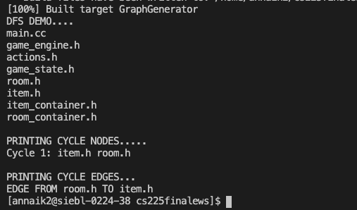
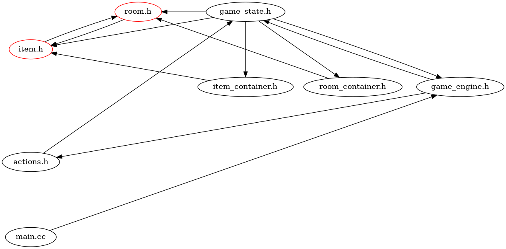
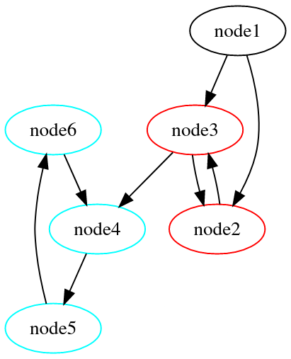

We started out project with our driving question being "Can we utilize file dependencies in order to create a dependency graph that allows for easier control flow management?"

To achieve this, we decided to create four core classes backed by a common graph class.

### Classes
1. **Graph:** The graph class contains a node struct that simply stores the name of the node, and the maximum distance from the root of the graph. The graph itself is implemented using an adjacency list (`std::unordered_map`) which has a `Node` as a key and a `std::vector` of `Nodes` as the value. We also implemented a custom hashing function for our node that hashes the name of each node (this is deterministic because filenames will be unique).

2. **FileExplorer:** The file explorer uses dirent to read all the files in the given folder path, and stores the absolute path of each file. It recurses down every sub directory to store all possible files with C++ extensions
(`.h`,`.cpp`,`.hpp`,`.cc`). 

3. **TextParser:** The text parser takes in a certain file path and returns a `std::vector<string>` of all the paths the are next to `include` statements. 

4. **GraphGenerator:** The graph generator will recursively generate a graph using the file explorer and the text parser. First, it recieves a root folder and a root file (typically the `main` file). It then sets up a file explorer to get all the files in the folder, and parses the text in the file through the text parser. We then add each file and its dependencies to a `Graph`. 

5. **CycleDetector:** The cycle detector uses a recursive DFS version of Tarjan's algorithm in order to create a vector of sets of nodes, where each set represents the nodes in a cycle. Along the way, the edges that cause a cycle are also stored to help avoid infinite recursions due to cycles in our other algorithms. It also returns a set of cycle edges (the last edge of each cycle), and passes that back into the `Graph` class for node coloring.

### App
There are two main example apps that we created. 

The first, `graph_generator_main.cpp`, uses our example project repository to generate a graph and create an image. It also outputs a demo of our DFS algorithm and the cycle nodes. Both the DFS output and the small dependency graph are shown below.

As you can see, the nodes that are in a cycle are colored. 

The second, `cinder_graph_gen_main.cpp`, uses the Cinder library and the `BasicApp.cpp` sample app to create a graph and output the image (click on image for larger image).

We see that this created graph is extremely large, which is expected with a library like Cinder. If we zoom into this image, we can see our nodes and edges. The nodes are presented in a layered format, with the root file starting at the bottom. In the future, we hope to implement curved edges in order to reduce the amount of overlapping edges, and we would like to move the root to the top.

### Analyzing Results
We started with the goal of creating a dependency graph to allow for easier control flow management. We think that through our implementation, we have created this successfully. We implemented a DFS algorithm, and were able to use GraphViz to create a layered graph drawing. We were also able to implement node coloring that colors each cycle in the graph with a different color. Finally, we successfully used Tarjan's cycle detection algorithm to check for cyclical dependencies within a repository. The image below shows all of these in action (at a smaller scale so its readable). We see the layers of the graph, the cycles, and the colors showing that the cycles are successfully detected. 

### Challenges
Along our way, we faced many challenges. We had to decide what graph implementation to use, how to successfully explore files through dirent, and how to implement our own layered drawing in GraphViz, among more. In this section, we will talk about a few of our bigger challenges.

1. **Brent's Cycle Detection:** Brent's cycle detection was our original goal for our cycle detection algorithm. However, due to complications with the structure of our code, this was a huge issue. The way we implemented the graph (which was with an adjacency list) did not allow for an easy implementation of Brent's. Rather than work *with* the fact that we had to use Brent's, we implemented the graph first without putting much thought into that design decision. Therefore, we decided to go along with a recursive DFS-based version of Tarjan's algorithm.
2. **Integrating Graphviz** was definitely another challenge we faced while coding. Setting the library up with CMake, reading documentation about the different components that go into rendering Graphviz graphs, and integrating our own custom layered graph drawing algorithm using the neato engine all came with their own challenges and there were a host of bugs that we encountered. However, seeing the results of all that work was very rewarding.
3. One major challenge throughout the different algorithms was dealing with **infinite recursions**. In a way, this also ties in to the cycle detection algorithm, because the root cause of the infinite recursions was the cyclical dependencies in our test repositories. For example, in our node positioning for the layered graph drawing algorithm, there were a lot of issues with cyclical dependencies even when we tracked already visited nodes as we traversed through the graph. For this reason, we also had to track which edges caused cycles in order to overcome this challenge.